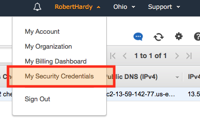
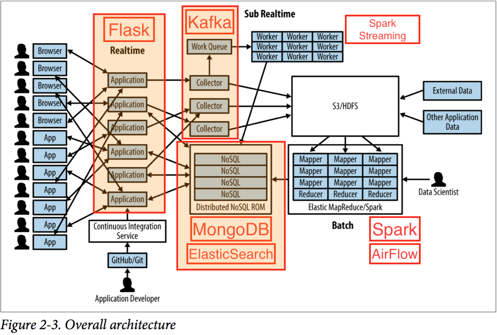
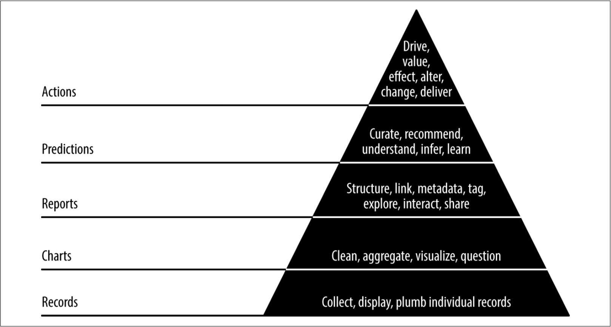

---

Sample chapter
====

[https://www.safaribooksonline.com/library/view/agile-data-science/9781491960103/ch04.html](https://www.safaribooksonline.com/library/view/agile-data-science/9781491960103/ch04.html)

Russell maintains all source code and a full EC2/Vagrant ready-to-go machine on
GitHub.

[https://github.com/rjurney/Agile_Data_Code_2](https://github.com/rjurney/Agile_Data_Code_2)

—-

In the author’s words
====
 > Most research sits on a shelf and never gets into the hands of people it can benefit. This book is a prescription and methodology for doing applied research that makes it into the world in the form of a product.

---

Much more
====
This is my go-to textbook for big data architecture.

This is the only book I have come across which gives
- all the details of a big-data architecture
- all the code (& scripts)
- all wrapped up in an EC2 instance.

This is my reference point for how to do ‘Agile research’.

---

Spin it up!
====



    brew install jq
    git clone —-
    pip install awscli

    aws configure      (us-east-2)
    ./ec2.sh

Back in 5 mins …

---

2 streams
====
* How to build a big-data web application.
    * Apache Spark, Spark MLlib, Spark Streaming
    * Apache Kafka
    * Doc stores: MongoDB, ElasticSearch
    * Scikit-learn
    * Python Flask
    * AirFlow
* How to apply Agile concepts to research problems.
    * Iterate, deliver intermediate assets.
    * The data-value pyramid.

Note to self: no Pandas, no Postgres.

---
Architecture
====



---

Front end
----


---

Back end
----


---

Jupyter notebooks
====

    ./ec2_create_tunnel.sh
    ssh -i ./agile_data_science.pem ubuntu@<public-dns>

    cat agile_data_science.message
    cd Agile_Data_Code_2
    jupyter notebook

Now visit [http://localhost:8888](http://localhost:8888)

---
Spark intro
====

---

How to be Agile
===

---

The data-value pyramid
====


---

ADS Manifesto
====
1. Iterate, iterate, iterate.
2. Ship intermediate assets (avoid the death loop).
3. ‘Prototype experiments’ rather than ‘implement tasks’.
4. Listen to the data (customers, developers, business _and_ data).
5. The data-value pyramid.
6. Find the critical path then focus on it.
7. Get meta, document the analytics process.

(See page 6.)

---

TL;DR
====
1. Present your intermediate work often, for feedback.
2. The data-value pyramid will help you establish a solid base.

Intermediate assets are valuable: they were necessary steps in your journey to the destination.

(And they might be all you have to show for much longer than you think.)

---

For example
====

* People work in Jupyter notebooks that are stored in a central repository.
* Jenkins converts them to scripts and checks that they run without errors.
* When they break we make a decision.
* We refactor code and build libraries.
* When we find something good we produce an automated report.
* When a report is liked we create a new page in our web app.
* We are climbing up the pyramid!

---

For example
====

* Full Stack Quants is Agile!
* Why wait until my presentation is perfect?
* For example, I haven’t thoroughly read the AirFlow and Spark Streaming sections yet, but there is still plenty to talk about.
* Intermediate assets:
    * Live coding, TDD, Git.
    * Trello for presentations.
    * GitPitch.
    * I am finding tools that make it easier to build content and which fit my
lifestyle.

---

How to build a big-data app
===

---

Components
====
1. Storage: Spark, MongoDB, Parquet, JSON Lines.
2. Data work: Python scripts with `spark.sql` and `spark.map`, etc.
3. Viewing: Python Flask, HTML.
4. Searching big data: ElasticSearch.
5. Predictions: Scikit-learn, Spark MLlib.
6. Data pipeline: AirFlow.

---

What/where data?
====
Data is stored in 5 places:
1. Wget into files, p91.
2. Load into Spark, p92.
3. SQL from Spark to JSON and Parquet files, p93. (259 MB, 248 MB). I guess that these files would be distributed across the cluster.
4. From Spark to MongoDB, p95.
5. From Spark to ElsaticSearch, p113.

---

Spark query to MongoDB
====
Investigating seasonality in flights.

Spark SQL query saved to MongoDB then displayed as a table in a web page.

```
on_time_dataframe = spark.read.parquet('data/on_time_performance.parquet')
    on_time_dataframe.registerTempTable("on_time_dataframe")
    total_flights_by_month = spark.sql(
"""SELECT Month, Year, COUNT(*) AS total_flights FROM on_time_dataframe
GROUP BY Year, Month
ORDER BY Year, Month"""
)
```

—-

Main tech
====
* Zookeeper to ‘orchestrate’ Kafka, p55. We start a daemon for zookeeper from within the Kafka directory and then start kafka with reference to a zookeeper config file. I checked on SO and find that Kafka _cannot_ be run without zookeeper.
* ElasticSearch to ‘find records’, p50 ‘using ElasticSearch to search our data, to make it easy to find the records we’ll be working so hard to create.’ Does this mean that all the data is available to search, or just the aggregated results? I think it is all indexed; it is searched from the web page. Great idea really, it means you can quite easily browse the data.

---

* ‘Kafka messages are grouped into topics’, p55 ‘we will be using Kafka to deploy predictions using Spark Streaming, but it can do much more.’ On p55 he runs the ‘console producer’ where we can publish messages to a topic (you write some Json) and then the ‘console consumer’ plays it back.
* Spark streaming has a ‘period’ of 10 seconds and ‘creates a Kafka stream’, p57. It listens to Kafka messages and acts on them — Russell prints the message in a Kafka object to the pyspark console.
* Apache Airflow to manage batch processing. AA uses DAGs. Clever that it can backfill so easily.

---

* p112 builds an index in ES for the flight information that is displayed in a page. It will provide a search box for the page, see p113: ‘Note that this might take some time, as there are several million records to index. You might want to leave this alone to run for a while.’
* Note that the data is passed to ES in batches from Spark (because the data is all stored in RDDs with Spark).

---

The storage bit
====
Data is stored in 5 places:
1. Wget into files, p91. (273 MB or 315 MB?)
2. Load into Spark, p92.
3. SQL from Spark to JSON and Parquet files, p93. (259 MB, 248 MB). I guess that these files are distributed across the cluster.
4. From Spark to MongoDB, p95.
5. From Spark to ElsaticSearch, p113.

---

* the flight data is wget on p91. It is load to spark on p92. It is then saved to the data dir in Parquet format on p93.
* The storage happens on p94: ‘Note that the Parquet file is only 248 MB, compared with 315 MB for the original gzip-compressed CSV and 259 MB for the gzip-compressed JSON. In practice the Parquet will be much more performant, as it will only load the individual columns we actually use in our PySpark scripts.’
* On p95 the whole rdd is loaded into MongoDB. That means that there are multiple copies of the data.
* On p113 the whole RDD is loaded to ElasticSearch in batches of 100. ‘Note that this might take some time, as there are several million records to index’.

---

Storage formats
====
* JSON lines is just JSON by line, typically a dict per line. Like CSV really.

---

The web app
====
* The first few pages show (paginated) all the flights between 2 airports on a given date, p109. This data comes from MongoDB.
* The next iteration is to allow a search with ES, p117.

---

Agile checkpoints
====
* p102 proposes we release the app without search, even though ‘To get real utility from this data, we need list and search capabilities.’
* Why? Because we need User validation: ‘“Does anyone care about flights?” and “What do they want to know about a given flight?” We think we have answers to these questions: “Yes” and “Airline, origin, destination, tail number, date, air time, and distant ce flown.” But without validation, we don’t really know anything for certain.’

---

* ‘The other reason to ship something now is that the act of publishing, presenting, and sharing your work will highlight a number of problems in your platform setup that would likely otherwise go undiscovered until the moment you launch your product.’

---

Batch processing with AirFlow
====
* on p242 there is a web endpoint set up for generating prediction requests. These will be processed as if they are a daily request, and might result in a daily email in your inbox.

